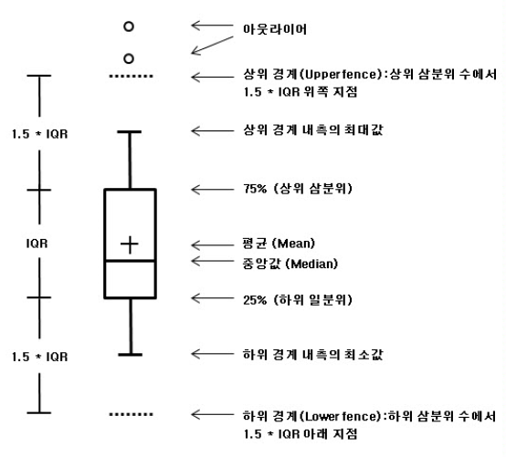

# 산포도

- 어떤 분포에 대한 이해는 중심경향값과 산포도 모두를 고려
- 자료의 분포가 얼마나 흩어져 있는지 아니면 뭉쳐 있는지를 알려 주는 통계치들을 통칭하여 산포도(measure of dispersion)

---

## 분산과 표준편차

##### 분산의 공식

###### 모집단 분산 공식

$\sigma^2 = \frac{\sum\limits_{i=1}^N (X_i-\mu)^2}{N}(\sigma:모집단의 표준편차, X_i:관측치,\mu:모집단 평균, N:전체 사례 수)$

###### 표본 분산 공식

$S^2 = \frac{\sum\limits_{i=i}^n(X_i-\bar{X})^2}{n-1} (S:표본의 표준편차, X_i:관측치, \bar{X}:표본 평균, n:표본의 사례 수)$

---

## 분산과 표준편차

- 관측치에서 평균을 뺀 편차 점수(deviation score)의 제곱의 합
- 편차점수 $(X_i-\mu)$는 관측치에서 평균을 뺀 값이므로 관측치가 평균보다 얼마나 큰지 작은지 알려줌
- 편차점수의 모든 합은 0
- 분산 공식에서 편차점수를 제곱하여 더함으로써 자료가 평균으로부터 얼마나 떨어져 있는지 정리
- 분산에 제곱근을 씌운 값이 표준편차(standard deviation)
- 분산 단위는 확률변수의 제곱이므로 해석이 어려움
- 표준편차는 분산의 제곱근이므로 평균과 같은 단위. 따라서 해석 목적이라면 표준편차를 이용

---

# 사분위편차(quartile)

- 작은 값부터 큰 값으로 정렬한 후 4등분한 점에 해당하는 값
- 두 번째 사분위편차(Q2)는 중앙값, - 네 번째 사분위편차(Q4)는 제일 마지막 값과 동일
- 첫 번째 사분위편차와 세번째 사분위편차(Q3)만 제시

---
