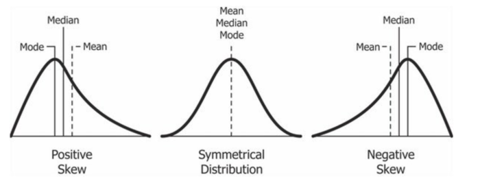

# 중심경향값
----
## 평균(mean)

- 통계값 중에서 가장 주요한 값
- 전체 자료 값을 더한 후 사례 수로 나눈 값
- 모집단, 표본 관계없이 동일한 방법으로 구할 수 있음

### 모집단

$\mu = \frac{\sum\limits_{i=1}^N X_i}{N}$ ($\mu:모집단 평균, X_i:관측치, N:전체 사례 수)$

### 표본

$\bar{X} = \frac{\sum\limits_{i=1}^n X_i}{N}$ ($\bar{X}:표본 평균, X_i:관측치, n:전체 사례 수)$

-------

### 평균 사용이 적절하지 않은 경우

예시

> 교환학생을 가려고 자료를 찾던 중 1월 평균 기온이 0도 7월 기온이 22도를 발견하고 해당 대학을 선택. 하지만 1월 기온이 영하 15도에서 영상 15도까지 변덕. 7월 기온은 30도를 웃도는 날이 빈번.

- 변화폭이 크지만, 평균은 그 중간을 가르키는 경우

예시

> S전자에 일하는 지인의 하소연. 상여금 시즌마다 큰 돈을 번다고 알려져 있지만 본인은 한 번도 그 돈을 받아본 적이 없음. S전자의 평균 상여금을 기준으로 언론에서 언급하기 때문. 실제 임원과 사원 모두를 한꺼번에 말하고 있기 때문

- 정규분포를 따르지 않는 자료의 경우 평균만을 대표값으로 활용하는 것은 적절하지 않음

-------

## 중앙값

- 평균은 극단치에 의해 영향을 받음
  > 50, 50, 50, 90의 점수 평균은 60이지만, 중앙값, 최빈값은 50이 된다.
- 극단치가 있는 자료의 경우 중앙값을 사용하는 것이 적절

#### 중앙값의 정의

- 자료를 순서대로 줄 세울 때, 중앙에 위치하는 값
- 자료가 짝수 개인 경우 중앙값은 중간의 두 개 값의 평균
  > 1,2,2,3,4,5,5,5,6,7 의 경우 중앙값은 4, 5의 평균인 4.5
- 한쪽으로 쏠린 편포 분포에도 극단적인 값에 영향이 적음
- 양극단의 급간이 열려 있는 개방형 분포에도 이용 가능

-------

#### 중앙값 공식

자료를 순서대로 줄을 세울 때

자료의 수가 홀수인 경우 $\frac{n+1}{2}$번째 관측값

자료의 수가 짝수인 경우 $\frac{n}{2}$번째와 $\frac{n}{2}+1$ 번째 관측값의 평균

-------

## 최빈값

- 어떤 값이 가장 빈번하게 나왔는지 알려주는 값
- 빈도가 너무 작거나 분포의 모양이 명확하지 않을 때 최빈값이 안정적이지 못함
- 자료에 따라 최빈값이 여러 개가 될 수 있음
- 명명, 서열, 동간, 비율 네 가지 척도 모두에 이용 가능

