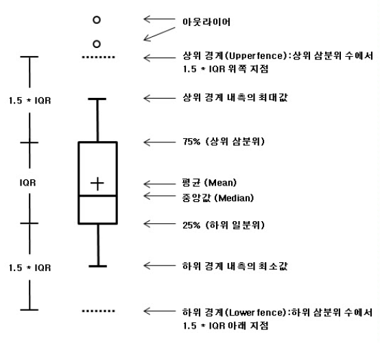

# 중심경향값

---

## 평균(mean)

- 통계값 중에서 가장 주요한 값
- 전체 자료 값을 더한 후 사례 수로 나눈 값
- 모집단, 표본 관계없이 동일한 방법으로 구할 수 있음

### 모집단

$\mu = \frac{\sum\limits_{i=1}^N X_i}{N}$ ($\mu:모집단 평균, X_i:관측치, N:전체 사례 수)$

### 표본

$\bar{X} = \frac{\sum\limits_{i=1}^n X_i}{N}$ ($\bar{X}:표본 평균, X_i:관측치, n:전체 사례 수)$

---

### 평균 사용이 적절하지 않은 경우

예시

> 교환학생을 가려고 자료를 찾던 중 1월 평균 기온이 0도 7월 기온이 22도를 발견하고 해당 대학을 선택. 하지만 1월 기온이 영하 15도에서 영상 15도까지 변덕. 7월 기온은 30도를 웃도는 날이 빈번.

- 변화폭이 크지만, 평균은 그 중간을 가르키는 경우

예시

> S전자에 일하는 지인의 하소연. 상여금 시즌마다 큰 돈을 번다고 알려져 있지만 본인은 한 번도 그 돈을 받아본 적이 없음. S전자의 평균 상여금을 기준으로 언론에서 언급하기 때문. 실제 임원과 사원 모두를 한꺼번에 말하고 있기 때문

- 정규분포를 따르지 않는 자료의 경우 평균만을 대표값으로 활용하는 것은 적절하지 않음

---

## 중앙값

- 평균은 극단치에 의해 영향을 받음
  > 50, 50, 50, 90의 점수 평균은 60이지만, 중앙값, 최빈값은 50이 된다.
- 극단치가 있는 자료의 경우 중앙값을 사용하는 것이 적절

#### 중앙값의 정의

- 자료를 순서대로 줄 세울 때, 중앙에 위치하는 값
- 자료가 짝수 개인 경우 중앙값은 중간의 두 개 값의 평균
  > 1,2,2,3,4,5,5,5,6,7 의 경우 중앙값은 4, 5의 평균인 4.5
- 한쪽으로 쏠린 편포 분포에도 극단적인 값에 영향이 적음
- 양극단의 급간이 열려 있는 개방형 분포에도 이용 가능

---

#### 중앙값 공식

자료를 순서대로 줄을 세울 때

자료의 수가 홀수인 경우 $\frac{n+1}{2}$번째 관측값

자료의 수가 짝수인 경우 $\frac{n}{2}$번째와 $\frac{n}{2}+1$ 번째 관측값의 평균

---

## 최빈값

- 어떤 값이 가장 빈번하게 나왔는지 알려주는 값
- 빈도가 너무 작거나 분포의 모양이 명확하지 않을 때 최빈값이 안정적이지 못함
- 자료에 따라 최빈값이 여러 개가 될 수 있음
- 명명, 서열, 동간, 비율 네 가지 척도 모두에 이용 가능

---

# 산포도

- 어떤 분포에 대한 이해는 중심경향값과 산포도 모두를 고려
- 자료의 분포가 얼마나 흩어져 있는지 아니면 뭉쳐 있는지를 알려 주는 통계치들을 통칭하여 산포도(measure of dispersion)

---

## 분산과 표준편차

##### 분산의 공식

###### 모집단 분산 공식

$\sigma^2 = \frac{\sum\limits_{i=1}^N (X_i-\mu)^2}{N}(\sigma:모집단의 표준편차, X_i:관측치,\mu:모집단 평균, N:전체 사례 수)$

###### 표본 분산 공식

$S^2 = \frac{\sum\limits_{i=i}^n(X_i-\bar{X})^2}{n-1} (S:표본의 표준편차, X_i:관측치, \bar{X}:표본 평균, n:표본의 사례 수)$

---

## 분산과 표준편차

- 관측치에서 평균을 뺀 편차 점수(deviation score)의 제곱의 합
- 편차점수 $(X_i-\mu)$는 관측치에서 평균을 뺀 값이므로 관측치가 평균보다 얼마나 큰지 작은지 알려줌
- 편차점수의 모든 합은 0
- 분산 공식에서 편차점수를 제곱하여 더함으로써 자료가 평균으로부터 얼마나 떨어져 있는지 정리
- 분산에 제곱근을 씌운 값이 표준편차(standard deviation)
- 분산 단위는 확률변수의 제곱이므로 해석이 어려움
- 표준편차는 분산의 제곱근이므로 평균과 같은 단위. 따라서 해석 목적이라면 표준편차를 이용

---

# 사분위편차(quartile)

- 작은 값부터 큰 값으로 정렬한 후 4등분한 점에 해당하는 값
- 두 번째 사분위편차(Q2)는 중앙값, - 네 번째 사분위편차(Q4)는 제일 마지막 값과 동일
- 첫 번째 사분위편차와 세번째 사분위편차(Q3)만 제시
  

---

# 표준점수

- 원점수에서 평균을 뺀 편차점수를 표준편차로 나눈 점수들을 통칭
- Z-점수, T-점수, 스테나인 점수
- Z-점수, T-점수는 모집단의 분포가 정규분포(normal distribution)이라 가정할 때 이용 가능

---

# 표준점수

---

## Z-점수, T-점수

- Z-점수는 평균 0, 분산이 1인 표준정규분포를 따르는 점수
- T-점수는 평균을 50으로 하고 표준편차를 10으로
- Z-점수의 분포는 반은 양수, 반은 음수
- T-점수는 Z-점수를 음수가 나오지 않도록 조정

###### Z-점수와 T-점수 공식

> $Z  = \frac{X-\mu}{\sigma}$
> $T = 10Z+50$

---

### 스태나인(stanine)

- 스태나인은(STAndard NINE)으로 자료를 9개로 표준화한다는 뜻
- 자료를 작은 순서부터 큰 순서로 정렬 후, 왼쪽부터 오른쪽까지 1등급부터 9등급까지
- 최하가 1등급, 최고가 9등급
- 최고를 1등급, 최하를 9등급으로 바꾸어 쓰기도 함

---

###### 스태나인 공식

> $Stanine = 2Z + 5$

---

---

## marp: true

# 확률변수와 정규분포

---

#### 변수와 상수

변수: 구인을 조작정 정의를 통하여 측정하는 것(변하는 값)
상수: 변하지 않는 값($e, \pi$)

### 확률변수(random variable)

확률변수: 통계학에서의 변수.어떤 사건(event)이 일어날 확률이 정의되는 변수

예

> 주사위를 2번 던져서 눈이 1개 나올 경우를 세어 본다고 할 때, 한번도 안나올 수 있고(0), 2번 중 한 번만 나올 수 있고(1), 2번 모두 나올 수 있다(2). 따라서 주사위 눈이 1인 횟수를 확률변수 X라 하면, X는 0, 1, 2의 값을 가진다.

---

# 확률변수의 특징

예

> 무선으로 표집된 학생의 키를 확률변수 X라 하고, n명을 표집한 후 그 표본을 $X_1, X_2, ... ,X_n$ 이라고 하자. 각 수치에 학생이 몇명이 분포하는지 구하여 확률을 계산할 수 있다.

X의 관측값이 $x$일 확률을 $P(X=x)$라 표기한다.
예

> 동전의 앞면이 나올 확률은 $P(X=앞)$이 된다.

또, $P(X=x) 를 P(x)$라고 쓰기도 한다.

---

# 확률변수의 특징

참고로 X가 연속형일 때, $P(x)$를 확률밀도함수(probability density function) X가 이산형(discrete)일 때 확률질량함수(probability mass function)이라고 한다.(이 책에서는 이하 이산형, 연속형 모두 확률밀도함수로 통칭)

# 확률밀도함수 특징

- $0 \leq P(x) \leq 1$
- 이산형 확률변수 $\sum\limits_{all\ i}P(x_i) = 1$
- 연속형 확률변수 $\int_{-\infty}^{\infty}f(x)dx=1$

---

## 기대값과 분산

- 기대값은 $E(X)$로 표기하고, 분산은 $Var(X)$로 표기
- 기대값은 모든 가능한 X의 값을 그 확률로 가중치를 두어 더한 값
  예) 수학점수의 기대값
  > 각각의 수학점를 확률로 곱하여 더한 값
  >
  > > 결국, 이 값은 평균과 동일
- 값은 동일하지만 기대값과 평균은 다른 값
- 기대값은 확률을 이용하여 구한 값, 평균은 자료를 모은 후 구한 값
- 분산은 $(X-\mu)^2$의 기대값
- 마찬가지로 확률을 가중치로 이용하여 구함

---

## 기대값과 분산 구하는 공식

|                           | 이산형 $X$인 경우                      | 연속형 $X$인 경우       |
| ------------------------- | -------------------------------------- | ----------------------- |
| 기대값$E(X)$              | $\sum\limits_{i=1}^nX_iP(x_i)$         | $\int{x}f(x)dx$         |
| 분산$Var(X)=E[(X-\mu)^2]$ | $\sum\limits_{i=1}^n(X_i-\mu)^2P(x_i)$ | $\int{(x-\mu)^2}f(x)dx$ |

---

## 정규분포

- 모든 분포 중 가장 기본적인 분포, 가장 중요한 분포
- 가우스의 이름을 따 가우스 분포라고 불르기도 함
- 정규분포는 평균을 중심으로 대칭의 종모양(bell-curve)
- 평균과 분산만 알면 그 분포의 형태를 알 수 있음
- 평균은 분포의 중심
- 분산은 평규ㅜㄴ을 중심으로 이 분포가 얼마나 퍼저있는지를 나타냄

---

## 정규분포

- 확률변수 X가 평균 $\mu$이고 분산이 $\sigma^2$인 정규분포를 따를 때
- $X \sim \mathcal{N}(\mu,\,\sigma^{2})$ 로 표기
- 확률변수 $X$의 중앙값, 최빈값 모두 $\mu$
- 왜도, 첨도 모두 0
- 평균 $\mu$ 분산 $\sigma^2$ 일때 확률밀도함수는 아래와 같다
  > $P(X=x) = \frac{1}{ \sqrt{2\pi}\sigma } e^{-\frac{(x-\mu)^2}{2\sigma^2}}
$

---

## 표준정규분포

- 정규분포 중 평균이 0이고 분산이 1인 것을 표준정규분포(standard normal distribution)
- 정규분포 확률밀도함수 식에 $\mu$에 0을, $\sigma$에 1을 넣고 풀어주면 표준정규분포 확률밀도함수와 같게 된다.
  > $X \sim \mathcal{N}(\mu,\,\sigma^{2})$ , $Z=\frac{X-\mu}{\sigma}\sim \mathcal{N}(0,1)$ > $P(Z=z) = \frac{1}{ \sqrt{2\pi} } e^{-\frac{z^2}{2}}
$

---

# 확률변수와 정규분포

---

#### 변수와 상수

변수: 구인을 조작정 정의를 통하여 측정하는 것(변하는 값)
상수: 변하지 않는 값($e, \pi$)

### 확률변수(random variable)

확률변수: 통계학에서의 변수.어떤 사건(event)이 일어날 확률이 정의되는 변수

예

> 주사위를 2번 던져서 눈이 1개 나올 경우를 세어 본다고 할 때, 한번도 안나올 수 있고(0), 2번 중 한 번만 나올 수 있고(1), 2번 모두 나올 수 있다(2). 따라서 주사위 눈이 1인 횟수를 확률변수 X라 하면, X는 0, 1, 2의 값을 가진다.

---

# 확률변수의 특징

예

> 무선으로 표집된 학생의 키를 확률변수 X라 하고, n명을 표집한 후 그 표본을 $X_1, X_2, ... ,X_n$ 이라고 하자. 각 수치에 학생이 몇명이 분포하는지 구하여 확률을 계산할 수 있다.

X의 관측값이 $x$일 확률을 $P(X=x)$라 표기한다.
예

> 동전의 앞면이 나올 확률은 $P(X=앞)$이 된다.

또, $P(X=x) 를 P(x)$라고 쓰기도 한다.

---

# 확률변수의 특징

참고로 X가 연속형일 때, $P(x)$를 확률밀도함수(probability density function) X가 이산형(discrete)일 때 확률질량함수(probability mass function)이라고 한다.(이 책에서는 이하 이산형, 연속형 모두 확률밀도함수로 통칭)

# 확률밀도함수 특징

- $0 \leq P(x) \leq 1$
- 이산형 확률변수 $\sum\limits_{all\ i}P(x_i) = 1$
- 연속형 확률변수 $\int_{-\infty}^{\infty}f(x)dx=1$

---

## 기대값과 분산

- 기대값은 $E(X)$로 표기하고, 분산은 $Var(X)$로 표기
- 기대값은 모든 가능한 X의 값을 그 확률로 가중치를 두어 더한 값
  예) 수학점수의 기대값
  > 각각의 수학점를 확률로 곱하여 더한 값
  >
  > > 결국, 이 값은 평균과 동일
- 값은 동일하지만 기대값과 평균은 다른 값
- 기대값은 확률을 이용하여 구한 값, 평균은 자료를 모은 후 구한 값
- 분산은 $(X-\mu)^2$의 기대값
- 마찬가지로 확률을 가중치로 이용하여 구함

---

## 기대값과 분산 구하는 공식

|                           | 이산형 $X$인 경우                      | 연속형 $X$인 경우       |
| ------------------------- | -------------------------------------- | ----------------------- |
| 기대값$E(X)$              | $\sum\limits_{i=1}^nX_iP(x_i)$         | $\int{x}f(x)dx$         |
| 분산$Var(X)=E[(X-\mu)^2]$ | $\sum\limits_{i=1}^n(X_i-\mu)^2P(x_i)$ | $\int{(x-\mu)^2}f(x)dx$ |

---

## 정규분포

- 모든 분포 중 가장 기본적인 분포, 가장 중요한 분포
- 가우스의 이름을 따 가우스 분포라고 불르기도 함
- 정규분포는 평균을 중심으로 대칭의 종모양(bell-curve)
- 평균과 분산만 알면 그 분포의 형태를 알 수 있음
- 평균은 분포의 중심
- 분산은 평규ㅜㄴ을 중심으로 이 분포가 얼마나 퍼저있는지를 나타냄

---

## 정규분포

- 확률변수 X가 평균 $\mu$이고 분산이 $\sigma^2$인 정규분포를 따를 때
- $X \sim \mathcal{N}(\mu,\,\sigma^{2})$ 로 표기
- 확률변수 $X$의 중앙값, 최빈값 모두 $\mu$
- 왜도, 첨도 모두 0
- 평균 $\mu$ 분산 $\sigma^2$ 일때 확률밀도함수는 아래와 같다
  > $P(X=x) = \frac{1}{ \sqrt{2\pi}\sigma } e^{-\frac{(x-\mu)^2}{2\sigma^2}}
$

---

## 표준정규분포

- 정규분포 중 평균이 0이고 분산이 1인 것을 표준정규분포(standard normal distribution)
- 정규분포 확률밀도함수 식에 $\mu$에 0을, $\sigma$에 1을 넣고 풀어주면 표준정규분포 확률밀도함수와 같게 된다.
  > $X \sim \mathcal{N}(\mu,\,\sigma^{2})$ , $Z=\frac{X-\mu}{\sigma}\sim \mathcal{N}(0,1)$ > $P(Z=z) = \frac{1}{ \sqrt{2\pi} } e^{-\frac{z^2}{2}}
$

---

---

## marp: true

# 중심극한정리

어떤 확률분포가 정규분포를 따른다고 말하기가 어렵다면?

표분의 크기가 크다면, 모집단의 분포가 정규분포를 따르지 않는다면?

---

## 표본 합의 분포

평균이 $\mu$이고 분산이 $\sigma^2$인 확률변수 $X$를 동일한 분포로 독립적으로 추출

- n번 추출할 때 표본을 $X_1,X_2,X_3,...X_n$
- $X_1$부터 $X_n$까지의 합을 $T$라고 하자
  T의 기대값
  > $T = X_1+X_2+...+X_n$ > $E(T)=E(X_1+X_2+...+X_n)$ > $=E(X_1)+E(X_2)+...+E(X_n)$ > $=\mu+\mu+...+\mu$ > $E(T)=n\mu$

---

T의 분산

> $T = X_1+X_2+...+X_n$ > $Var(T)=Var(X_1+X_2+...+X_n)$ > $=Var(X_1)+Var(X_2)+...+Var(X_n)$ > $=\sigma^2+\sigma^2+...+\sigma^2$ > $Var(T)=n\sigma^2$

- $T$의 분포는 평균이 $n\mu$이고 분산이 $n\sigma^2$인 정규분포에 근사함
- 따라서 $T\approx\mathcal{N}(n\mu, n\sigma^2)$

참고: $\sim$은 어떤 분포를 따른다. $\approx$는 어떤 분포를 근사한다.

---

## 표본 평균의 분포

### $\frac{T}{n}$의 기대값과 분산

> $E(\frac{T}{n})=\frac{1}{n}E(T)=\frac{1}{n}n\mu=\mu$

> $Var(\frac{T}{n})=\frac{1}{n^2}Var(T)=\frac{1}{n^2}n\sigma^2=\frac{\sigma^2}{n}$

- 모집단 분포에 관계없이 표본의 크기가 충분하다면
- 확률변수 X의 표본평균($\bar{X}$)에 대한 표집분포 평균은 $\mu$이고 분산은 $\frac{\sigma^2}{n}$이다.
- 일반적으로 표본이 30이상이라면 표집 평균의 분포가 정규분포에 근사하다고 한다.

---

### 중심극한정리 요약 1: 표본 합의 분포

$n$이 충분히 클 때
$X\sim\mathcal{N}(\mu, \sigma^2)$
$T =  X_1+X_2+...+X_n$
$T\approx\mathcal{N}(n\mu, n\sigma^2)$

### 중심극한정리 요약 2: 표본 평균의 분포

$n$이 충분히 클 때
$X\sim\mathcal{N}(\mu, \sigma^2)$
$\frac{T}{n} =\bar{X}=  \frac{X_1+X_2+...+X_n}{n}$
$\frac{T}{n} =\bar{X}  \approx\mathcal{N}(\mu, \frac{\sigma^2}{n})$

---

# 추리통계와 통계적 가설검증

---

# 추리통계?

- 기술 통계는 중심경향값, 산포토의 대표값으로 요약 정리
- 추리 통계는 모집단에서 표본을 추출하고 분석 후, 결과를 사용하여 모집단의 특성을 추론

---

# 통계적 가설검정 원리

- 통계적 가설검정은 귀류법

  > 예) $\sqrt{2}$ 가 무리수인 것을 밝히기 위해 $\sqrt{2}$를 유리수로 가정. $\sqrt{2}$가 유리수이며 논리에 맞지 않게 됨으로 $\sqrt{2}$는 유리수가 아닌 무리수일 수 밖에 없다는 결론에 도달

- 통계적 가설검정에는 서로 대립되는 영가설, 대립가설을 설정
- 대립가설이 옳음을 증명하기 위해 영가설이 참이라고 설정
- ✨영가설(null hypothesis, 귀무가설, $H_0$)은 다른 증거가 없을 때 사실로 여겨지는 가설
- ✨대립가설(alternative hypothesis, $H_A$)는 연구자가 주장하는 가설

---

# 통계적 가설검정 원리

> 예) 연구자가 제작한 프로그램이 효과적이라는 것을 보여주기 위해 실험설계 후 자료를 수집했다. 연구자는 실험집단과 통제집단이 다르다는 것을 보이고 싶지만, 다른 증거가 없다면 실험집단과 통제집단이 프로그램 처치 후 차이가 없다고 생각하게 된다. 결과적으로 **'두 집단 간의 차이가 없다'** 가 영가설. **'두 집단의 차이가 있다'** 가 대립가설이 된다.

| 연구가설, 영가설, 대립가설                            |
| ----------------------------------------------------- |
| 연구가설: 실험집단의 평균이 통제집단의 평균과 다르다. |
| 영가설($H_0$): 집단 간 차이가 없다.                   |
| 대립가설($H_A$): 집단 간 차이가 있다.                 |

- 연구자의 자료 수집을 통해 실험집단과 통제집단이 같다고 하기에는 확률이 매우 낮다면, 미리 정해 둔 통계적 기준(유의수준)에 따라 영가설 기각 여부를 결정

---

## 영가설, 대립가설, 단측검정, 양측검정

- 일반적인 실험설계에서 연구자는 처치를 받은 실험집단, 처치를 받지 않은 통제집단을 비교하여 처치가 효과적임을 밝히고자 함.
- 실험집단과 통제집단의 평균이 다르다면 효과에 대해 밝힐 수 있음.
- 따라서 영가설은 일반적으로 **'차이가 없다', '같다'** 가 됨.
- 대립가설은 **'차이가 있다','같지 않다'**가 됨.

---

# 단측검정의 영가설과 대립가설

> 상황) A인문계 고등학교 3학년 학생들은 10시까지 야간자율학습을 한다. 지난번 학습 실태조사에서 야간자율학습 후 학생들의 가정학습 시간은 평균 2시간으로 조사되었다. 이 학교 고등학교 3학년 담임인 김 교사는 10시까지 야간자율학습을 하고 아침 7시 50분까지만 등교하면 되기 때문에 가정학습 시간이 그보다는 더 많을 것이라고 생각했다. 김 교사가 학생들을 개별 면담하였을 때도 학생들은 2시간 넘게 가정학습을 한다고 말했다. 김교사는 3학년 학생들의 평균 가정학습 시간이 2시간이 넘을 것이라고 생각하고, 100명의 A고등학교 3학년 학생들을 무선으로 표집하였다.

- 김교사 주장 ➡️ **학생들의 평균 가정학습 시간이 2시간이 넘을 것이다.**
- 대립가설: **A 인문계 고등학교 3학년 학생들의 평균 가정학습 시간이 2시간을 초과한다.**
- 영가설: **A 인문계 고등학교 3학년 학생들의 가정학습 시간이 2시간이다.**

---

## 단측검정

- 한쪽 방향으로 검정하는 것(one-tailed test)

##### 단측검정의 영가설과 대립가설

$$H_0: \mu \le 2$$
$$H_A: \mu \gt 2$$

## 양측검정

- 양쪽 방향으로 검정하는 것(two-tailed test)

##### 양측검정의 영가설과 대립가설

$$H_0: \mu = 2$$
$$H_A: \mu \ne 2$$

---

# 제1종 오류, 제2종 오류 , 신뢰구간, 검정력

---

### 제1종 오류, 제2종 오류

- 진실 여부가 불확실한 상황에서 진실과 결정은 총 4가지 상황이 만들어짐

> 예)자녀의 친자 검증을 하는 상황. 영가설은 다른 증거가 없을 때 친자가 아니라고 생각함으로 **친자가 아니다** 가 영가설이 됨. 이때 친자가 아닌 것이 진실인 상황에서 결정은 **친자가 아님** 과 **친자임** 의 두 가지가 가능. 반대로 **친자임** 이 진실인 상황에서 결정은 **친자가 아님** 과 **친자임** 두 가지가 있을 수 있음. 각 진실에 따라 오류는 총 2가지가 생길 수 있음.

---

### 제 1종 오류, 제 2종 오류

| 결정\진실                                       | 친자가 아님  (영가설이 참) | 친자임 (대립가설이 참)       |
| ----------------------------------------------- | ----------------------------- | ------------------------------- |
| 
친자가 아님 (영가설을 기각하지 않음) | 
오류 아님             | 
**제2종 오류**
 |
| 
친자임 (영가설 기각)                 | 
**제1종 오류**        | 
오류 아님               |

- 제1종 오류 확률(Type 1 error rate) $\alpha$로 표기
  영가설이 참인데 영가설을 기각하지 않는 경우에 대한 확률

- 제2종 오류 확률(Type 2 error rate) $\beta$로 표기
  대립가설이 참인데 영가설을 기각하지 않는 경우에 대한 확률

  ***

### 제 1종 오류, 제 2종 오류 예시

| 결정\진실                                 | 2시간  (영가설이 참)             | 2시간 초과 (대립가설이 참)              |
| ----------------------------------------- | ----------------------------------- | ------------------------------------------ |
| 
2시간 (영가설을 기각하지 않음) | 
$1-\alpha$ 오류 아님     | 
$\beta$ **제2종 오류**
 |
| 
2시간 초과 (영가설 기각)       | 
$\alpha$ 제1종 오류 확률 | 
$1-\beta$ 오류 아님             |

- $\alpha$와 $\beta$를 동시에 낮출 수 없음
- 일반적으로 영가설이 참인데 기각하는 것을 더 큰 오류라고 생각하며, 따라서 제1종 오류가 더 심각한 오판이라고 생각함
- 따라서 $\alpha$를 $\beta$보다 낮게 설정함
- 사회과학 연구에서는 $\alpha$를 0.05 $\beta$의 값을 0.2로 설정

---

### 왜 둘을 한꺼번에 낮출 수 없을까?

- 제1종 오류 확률을 낮추면 영가설을 기각하는 기준을 엄격하게 설정
  대립가설이 참일 수 있는 기회가 줄어들며, 제2종 오류가 증가

- 영가설을 기각하는 기준을 느슨하게 만들어 제2종 오류 확률을 줄이게 설정
  영가설이 참임에도 영가설이 기각되게 되며, 제1종 오류가 증가

> 예)의료검사
> 영가설->건강하다.
> $\alpha$를 줄여 거짓 양성을 줄이게 되면, 질병이 있는데 건강하다고 판단되는 확률이 증가
> 대립가설->'질병이 있다'
> $\beta$를 줄여 거짓 음성을 줄이게 되면, 건강함에도 질병이 있다고 판단되는 확률이 증가
